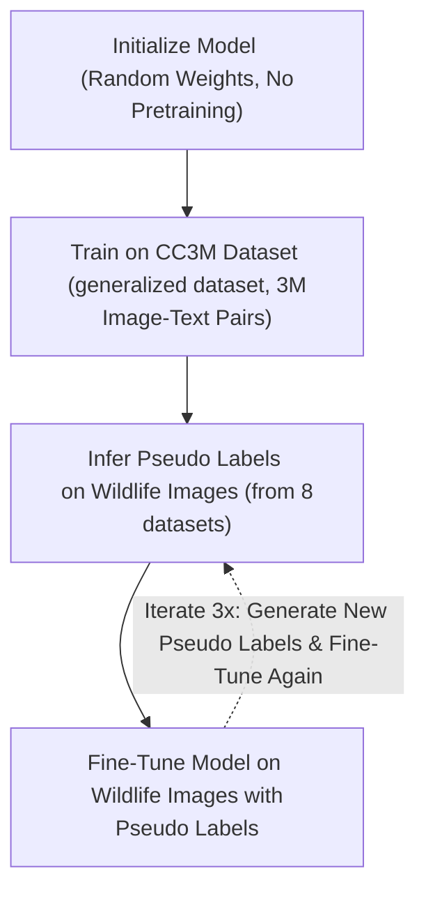

# Cerebro

## How it works
TL;DR: We trained our own [CLIP](https://openai.com/index/clip/)-style ViT model on a large dataset of 3M image-text pairs and then specialized wildlife photos. We use its embeddings for cosine similarity between the user's text input and the wildlife photos.

An embedding is a high-dimensional vector representation of something (a text or an image); the closer two vectors are, the more semantically similar they are. Eg. if you subtract the embedding of "mother" from the embedding of "father", you get a vector that is similar to the vector of "parents". This means that we can use cosine similarity to determine the similarity between two embeddings.

CLIP has two neural networks: one for images (in this case, a vision transformer) and one for text (a transformer, like GPT).

Given an image, the image encoder produces an embedding representing its visual features. Given a text string, the text encoder generates a corresponding embedding that captures its semantic meaning.

We scrape wildlife images, and for each image, we precompute its embedding and store it. When a user inputs a text query, it is converted into an embedding using the text encoder. Then, we calculate the cosine similarity between the text embedding and each image embedding.

The image with the highest cosine similarity (i.e., the smallest angle between the vectors in embedding space) is selected as the best match. This shared embedding space allows CLIP to generalize well to unseen image-text pairs, making it highly effective for zero-shot learning and retrieval tasks like ours.

## Training Scheme
We trained on 4x Nvidia RTX4090 with a VIT-B-32 model (~151m params). Everything is fairly meticulously optimized to use data parallelism and split across multiple GPU's. It's capable of scaling across multiple nodes for larger models (but which would take much more than our 24hr time limit to train).

Our training scheme is as follows:

For more details on pseudo-labelling, I gave [a talk](https://youtu.be/c8uWUOSGYUI?si=6LILuVIdwS-cxBMJ&t=193) on it 4 years ago.

CC3m was downloaded from [img2dataset](https://github.com/rom1504/img2dataset/blob/main/dataset_examples/cc3m.md) and took ~1 hour. Initial CC3M training took ~N hours on the 4x RTX4090 GPU's. Then, each pseudo label scheme took ~30min.

We used no externally pretrained models. Our model was a random weights initialization which we trained from scratch on CC3M, then fine tuned on wildlife images.