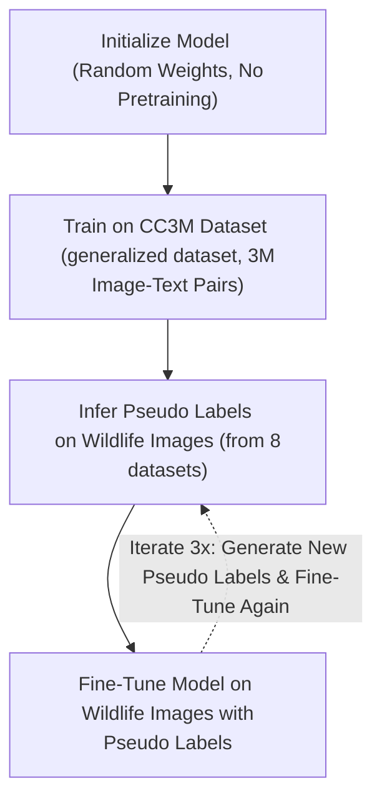

# Cerebro

## How it works
TL;DR: We trained a CLIP-style ViT model on a large dataset of 3M image-text pairs and then specialized wildlife photos. We use its embeddings for cosine similarity between the user's text input and the wildlife photos.

## Training
We trained on 4x Nvidia RTX4090 with a VIT-B-32 model (~151m params). 

Our training scheme is as follows:

For more details on pseudo-labelling, I gave [a talk](https://youtu.be/c8uWUOSGYUI?si=6LILuVIdwS-cxBMJ&t=193) on it 4 years ago.

CC3m was downloaded from [img2dataset](https://github.com/rom1504/img2dataset/blob/main/dataset_examples/cc3m.md) and took ~1 hour. Initial CC3M training took ~N hours on the 4x RTX4090 GPU's. Then, each pseudo label scheme took ~30min.

We used no externally pretrained models. Our model was a random weights initialization which we trained from scratch on CC3M, then fine tuned on wildlife images.